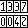
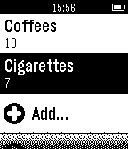
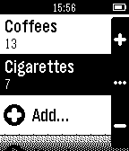

 MultiCount
==========

MultiCount is a Pebble application that allows you to manage a list of simple counters.

 

This is the first Pebble app I made, so the code may not have the best structure or follow all guidelines, but it works and I think it's not too bad. Please [send me any feedback](http://twitter.com/GilDev)!

Font used in the "Add" screen: [Bitstream Vera Sans Mono](https://www.gnome.org/fonts/)

Published under MIT license.

TODO:
-----

* Basalt (Pebble Time) support
* Better user interface
* Reordering counters in list
* Optimizations (save only modified counters to persistent storage for example)